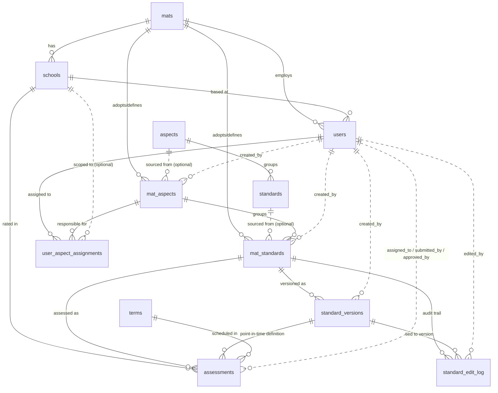

# Assurly — Data Model Reference

> **Purpose.** Single source of truth for the Assurly production database schema. Intended for use by humans, Cursor, and LLM assistants (Claude) when writing queries, building APIs, designing features, or reasoning about the domain.
>
> **How to read this.** Sections marked **`CURRENT`** describe what exists in production today. Sections marked **`PROPOSED`** describe corrections recommended after an April 2026 audit — they are NOT in production and must not be assumed when writing code. Sections marked **`INVARIANT`** are business rules enforced in the application layer, not the schema.
>
> **Last verified:** 20 April 2026, against production schema dump.
> **Stack:** MySQL 8, FastAPI (Python), React, GCP Cloud Run (`europe-west2`), project `assurly-455412`.

---

## 1. Domain overview

Assurly is a school-assurance and assessment-management platform for UK Multi-Academy Trusts (MATs). It lets a MAT track how each of its schools performs against a set of **standards** — compliance, risk, or quality measures — grouped into **aspects** (Education, HR, Finance, Estates, Governance, IT, plus custom ones a MAT can define). Assessments are rated each **term** on a 1–4 scale, with supporting evidence attached.

The domain has three layers of hierarchy:

1. **Default (platform) layer.** Assurly ships with a baseline set of aspects and standards. These live in `aspects` and `standards` and act as templates. A MAT can adopt them, ignore them, or modify them — the defaults themselves are never mutated.
2. **MAT layer.** When a MAT onboards, the aspects and standards it chooses are copied into `mat_aspects` and `mat_standards`. From this point on, the MAT owns its copy: it can rename it, retype it (`assurance` ↔ `risk`), version it, deactivate it, or delete it. Every change is versioned in `standard_versions` and logged in `standard_edit_log`. Custom aspects and standards created from scratch also live here.
3. **Assessment layer.** An assessment is the actual rating of one `mat_standard` for one `school` in one `term`. This is where the day-to-day work happens.

A MAT's **central office** is modelled as a school row with `is_central_office = 1` and `school_type = 'central'`. This lets trust-level assessments (e.g. MAT-wide governance) sit alongside school-level ones using the same table.

**Multi-tenancy.** Every query must filter by `mat_id` to enforce MAT isolation. Auth middleware derives `mat_id` from the session; no endpoint should trust a `mat_id` supplied in request parameters without cross-checking it against the session.

---

## 2. Conventions and patterns

### 2.1 Identifier strategy — be aware, it's inconsistent

The schema uses `char(36)` for most ID columns (suggesting UUIDs), but the actual ID values are a mixed bag of UUIDs, business codes, and slugs. Do not assume a `char(36)` column holds a UUID. Concretely:

| Entity | ID format in practice | Example |
|---|---|---|
| `mats.mat_id` | 3-letter business code | `HLT`, `OLT` |
| `aspects.aspect_id` | 2–3 letter code matching `aspect_code` | `EDU`, `HR`, `IT` |
| `standards.standard_id` | Short code matching `standard_code` | `BO1`, `EG3` |
| `schools.school_id` | URL slug OR business code for central offices | `cedar-park-primary`, `HLT-CENTRAL` |
| `users.user_id` | Mix of digits, `user<N>`, and `user<hex>` | `11`, `user10`, `user4a387bda` |
| `mat_aspects.mat_aspect_id` | `<MAT>-<ASPECT_CODE>` for adopted defaults, UUID for custom | `HLT-EDU`, `1ffe1f8c-32d7-400f-942a-d60a40d50e9a` |
| `mat_standards.mat_standard_id` | `<MAT>-<CODE>` composite | `HLT-AC1`, `OLT-FM6` |
| `standard_versions.version_id` | `<mat_standard_id>-v<N>` | `HLT-FM6-v2` |
| `assessments.id` | Real UUID v4 | `0ab66bc1-8800-4d1d-a643-eb6224668a3e` |
| `terms.unique_term_id` | `T<n>-<academic_year>` composite | `T1-2025-26` |

**Rule of thumb for new code:** never construct or parse these IDs as if they follow one canonical format. Read what the table actually holds; join on the column; don't regex-parse.

### 2.2 Soft-delete strategy — two tiers

Different entities use different deletion semantics. This is intentional:

- **`is_active` flag** on `mats`, `schools`, `users`, `mat_aspects`, `mat_standards`. Row is hidden from default queries but retained intact. Reinstatable. Used for temporary deactivation.
- **Archive-rename** on custom `mat_standards` only. When a custom (non-default) standard is permanently deleted, both its `mat_standard_id` and the `version_id` of every associated version get renamed with a `-deleted-<unix_timestamp>` suffix. This frees the original code for reuse while preserving history. Example: `HLT-AC5` → `HLT-AC5-deleted-1768213666`.
- **`deleted_at` timestamp** on `users` only. Soft-delete with a timestamp. Combined with `is_active = 0`.

**Rule:** queries listing entities for UI purposes should always filter `is_active = 1` AND (for mat_standards) exclude IDs matching `%-deleted-%`. The `v_mat_standards_current` view did this historically but views are deprecated — replicate the filter in your query.

### 2.3 Assessment composite key

`assessments` has a UUID primary key (`id`) AND a virtual-generated composite natural key (`assessment_id` = `<school_id>-<standard_code>-<unique_term_id>`). Both are unique per row. The UUID is the FK target; the composite is for human-readable display and UPSERT matching.

### 2.4 Timestamp handling

- All timestamps are MySQL `TIMESTAMP`, stored as UTC, converted on read. Application layer handles UK timezone display.
- `created_at` and `updated_at` follow the standard pattern: auto-set on insert, auto-updated on row modification.
- `assessments.last_updated` is the equivalent of `updated_at` (named differently for historical reasons).

### 2.5 RAG polarity

A rating of 4 does not universally mean "good". Polarity depends on `mat_standards.standard_type`:

- `standard_type = 'assurance'`: higher is better. `4` = green, `1` = red.
- `standard_type = 'risk'`: higher is worse. `4` = red, `1` = green.

This is applied both client-side (React utility) and potentially server-side (views/endpoints — audit pending). Any code computing RAG colour MUST take `standard_type` as input.

### 2.6 Rating scale

Rating is an integer, **strictly 1–4**, enforced at the DB level via CHECK constraint `chk_rating_range` on `assessments.rating`. Ofsted-style labels ("Outstanding", "Good", "Requires Improvement", "Inadequate") were once used but have been retired. A prior experimental "Exceptional" (5) value existed in one production row until 2026-04-20, when it was downgraded to 4 and the constraint added to prevent recurrence.

### 2.7 MAT isolation

Every API endpoint that reads or writes data related to a MAT MUST:

1. Derive `mat_id` from the authenticated user's session.
2. Apply `WHERE mat_id = :session_mat_id` (or an equivalent join condition) to every query.
3. For operations on child entities (schools, mat_standards, assessments, evidence), verify the entity's owning MAT matches the session MAT before proceeding.

Never accept `mat_id` as a request parameter from the frontend without cross-checking it against the session.

---

## 3. Entity-Relationship diagram



---

## 4. `mats`

The tenant. Every other piece of data belongs to exactly one MAT.

| Column | Type | Null | Default | Notes |
|---|---|---|---|---|
| `mat_id` | `char(36)` | NOT NULL | — | **PK**. In practice a 3-letter business code (`HLT`, `OLT`). |
| `mat_name` | `varchar(255)` | NOT NULL | — | Display name. |
| `mat_code` | `varchar(50)` | NULL | — | **UNIQUE**. Internal short code. Often same as `mat_id` but can differ (OLT's code is `OPA`). |
| `onboarding_status` | `enum` | NULL | `'completed'` | Values: not confirmed in schema; both live MATs are `'completed'`. |
| `onboarding_started_at` | `timestamp` | NULL | — | |
| `onboarding_completed_at` | `timestamp` | NULL | — | |
| `is_active` | `tinyint(1)` | NULL | `1` | Soft-delete flag. |
| `logo_url` | `varchar(500)` | NULL | — | |
| `primary_colour` | `varchar(7)` | NULL | — | Hex colour for branding. |
| `created_at` | `timestamp` | NULL | `CURRENT_TIMESTAMP` | |
| `updated_at` | `timestamp` | NULL | `CURRENT_TIMESTAMP` on update | |

**Relationships:** parent of `schools`, `users`, `mat_aspects`, `mat_standards`.

**Current data:** `HLT` (Harbour Learning Trust), `OLT` (Opal Learning Trust).

---

## 5. `schools`

A school within a MAT. The MAT's central office is also a row here, flagged by `is_central_office`.

| Column | Type | Null | Default | Notes |
|---|---|---|---|---|
| `school_id` | `char(36)` | NOT NULL | — | **PK**. Slug (`cedar-park-primary`) or code (`HLT-CENTRAL`). |
| `school_name` | `varchar(255)` | NOT NULL | — | |
| `mat_id` | `char(36)` | NOT NULL | — | **FK** → `mats.mat_id`. |
| `school_code` | `varchar(50)` | NULL | — | 3-letter internal code (`ERM`, `GCO`). Often blank for OLT schools. |
| `school_type` | `enum('primary','secondary','all_through','special','central')` | NULL | `'primary'` | `'central'` is used in combination with `is_central_office = 1` for MAT central offices. |
| `is_central_office` | `tinyint(1)` | NULL | `0` | `1` = this row represents the MAT's central office, not a school. Drives the REQ-005 Trust/School filter. |
| `is_active` | `tinyint(1)` | NULL | `1` | |
| `created_at` | `timestamp` | NULL | `CURRENT_TIMESTAMP` | |
| `updated_at` | `timestamp` | NULL | `CURRENT_TIMESTAMP` on update | |

**Invariant** (enforced in application layer, not schema): **exactly one row per `mat_id` has `is_central_office = 1`**. MySQL 8 can enforce this via a functional unique index, but we have not done so. New MATs must create a central office row at onboarding.

**Current data:** 7 HLT schools (1 central + 6 academies) and 5 OLT schools (1 central + 4 academies).

### `FIXED` 2026-04-20 — `Healing Secondary` school_type corrected

Row `healing-secondary-academy` had `school_type = 'primary'`. Updated to `'secondary'`.

### `PROPOSED` — tighten nullability

`is_central_office`, `is_active`, `school_type` should all be `NOT NULL` with defaults. Nullable booleans are a footgun. Low priority — no observed NULL values today.

---

## 6. `users`

Everyone who can log into Assurly. Every user belongs to one MAT.

| Column | Type | Null | Default | Notes |
|---|---|---|---|---|
| `user_id` | `char(36)` | NOT NULL | — | **PK**. Mixed formats in practice. |
| `email` | `varchar(255)` | NOT NULL | — | **UNIQUE**. |
| `full_name` | `varchar(255)` | NOT NULL | — | |
| `mat_id` | `char(36)` | NOT NULL | — | **FK** → `mats.mat_id`. Used for MAT isolation. |
| `school_id` | `char(36)` | NULL | — | **FK** → `schools.school_id`. NULL for MAT-level users (though today all active users point at their central office). |
| `role_title` | `varchar(100)` | NULL | — | Free-text job title. Not a permission role — all current users are `'MAT Administrator'`. |
| `is_active` | `tinyint(1)` | NULL | `1` | |
| `magic_link_token` | `varchar(255)` | NULL | — | Indexed. Transient: populated during magic-link login, cleared after use. |
| `token_expires_at` | `timestamp` | NULL | — | Paired with `magic_link_token`. |
| `last_login` | `timestamp` | NULL | — | |
| `created_at` | `timestamp` | NULL | `CURRENT_TIMESTAMP` | |
| `updated_at` | `timestamp` | NULL | `CURRENT_TIMESTAMP` on update | |
| `deleted_at` | `datetime` | NULL | — | Soft-delete timestamp. When set, `is_active` should be `0`. |

**Auth flow.** Magic-link authentication: user requests link → backend generates token, writes to `magic_link_token` + `token_expires_at`, emails link → user clicks → backend validates token, creates session, clears token. Session is the source of truth for `user_id` and `mat_id` on subsequent requests.

**Relationships:** referenced by `assessments` (assigned_to, submitted_by, approved_by), `mat_aspects.created_by_user_id`, `mat_standards.created_by_user_id`, `standard_versions.created_by_user_id`, `standard_edit_log.edited_by_user_id`, `user_aspect_assignments` (both `user_id` and `assigned_by_user_id`).

### `PROPOSED` — permission roles

`role_title` is free-text and all users are `'MAT Administrator'`. If/when user-management feature expands beyond admins, add a `role` enum column with values like `admin | editor | viewer` backed by code-level permission checks. Document in the User Management workstream, not as a schema fix today.

---

## 7. `terms`

Academic terms. Fully static reference data — three terms per year, populated for multiple years in advance.

| Column | Type | Null | Default | Notes |
|---|---|---|---|---|
| `unique_term_id` | `varchar(20)` | NOT NULL | — | **PK**. Composite: `T<n>-<academic_year>`. |
| `term_id` | `varchar(10)` | NOT NULL | — | `T1`, `T2`, `T3`. Not unique. |
| `term_name` | `varchar(50)` | NOT NULL | — | `'Autumn Term'`, `'Spring Term'`, `'Summer Term'`. |
| `start_date` | `date` | NOT NULL | — | |
| `end_date` | `date` | NOT NULL | — | |
| `academic_year` | `varchar(10)` | NOT NULL | — | Format `YYYY-YY`, e.g. `2025-26`. |

**Current data:** 2023-24, 2024-25, 2025-26, 2026-27 — all three terms each.

**Note:** `assessments.academic_year` duplicates what can be derived from `unique_term_id`. Kept for query convenience and partitioning-friendly layouts.

---

## 8. `aspects`

Platform-level (default) aspects. Read-only templates used during MAT onboarding. Do not write to this table at runtime.

| Column | Type | Null | Default | Notes |
|---|---|---|---|---|
| `aspect_id` | `char(36)` | NOT NULL | — | **PK**. Short code in practice. |
| `aspect_code` | `varchar(20)` | NOT NULL | — | **UNIQUE**. Same as `aspect_id` today. |
| `aspect_name` | `varchar(255)` | NOT NULL | — | |
| `aspect_description` | `text` | NULL | — | |
| `aspect_category` | `enum('ofsted', 'operational')` | NULL | `'operational'` | |
| `sort_order` | `int` | NULL | `0` | |
| `created_at` | `timestamp` | NULL | `CURRENT_TIMESTAMP` | |

**Current data:** 6 rows: `EDU`, `HR`, `FIN`, `EST`, `GOV`, `IT`.

---

## 9. `standards`

Platform-level (default) standards. Grouped by aspect. Read-only templates used during onboarding.

| Column | Type | Null | Default | Notes |
|---|---|---|---|---|
| `standard_id` | `char(36)` | NOT NULL | — | **PK**. Short code in practice (`BO1`, `EG3`). |
| `aspect_id` | `char(36)` | NOT NULL | — | **FK** → `aspects.aspect_id`. Enforced by constraint `fk_standards_aspect_id`. |
| `standard_code` | `varchar(20)` | NOT NULL | — | **UNIQUE**. |
| `standard_name` | `varchar(255)` | NOT NULL | — | |
| `standard_description` | `text` | NULL | — | |
| `standard_type` | `enum('assurance', 'risk')` | NULL | `'assurance'` | All 41 current rows are `assurance`. |
| `sort_order` | `int` | NULL | `0` | |
| `created_at` | `timestamp` | NULL | `CURRENT_TIMESTAMP` | |

**Current data:** 41 rows.

### `FIXED` 2026-04-20 — `aspect_id` orphan resolved

Previously, all 41 rows in `standards` held `aspect_id` values like `a0000001-0000-0000-0000-000000000001` that did not exist in the `aspects` table (an earlier rebuild of `aspects` with cleaner codes left `standards` pointing at dead UUIDs). Resolved by remapping the six UUIDs to their correct aspect codes (`EDU`, `HR`, `FIN`, `EST`, `GOV`, `IT`) based on the `standard_code` prefix grouping under each, then adding an FK constraint to prevent regression.

See backup `assurly_backup_v3` for the pre-fix state.

---

## 10. `mat_aspects`

A MAT's working copy of aspects. Populated from `aspects` at onboarding; the MAT then owns and can modify/deactivate/delete/extend. Also holds custom aspects a MAT creates from scratch (`is_custom = 1`).

| Column | Type | Null | Default | Notes |
|---|---|---|---|---|
| `mat_aspect_id` | `char(36)` | NOT NULL | — | **PK**. `<MAT>-<ASPECT_CODE>` for adopted defaults; UUID for custom. |
| `mat_id` | `char(36)` | NOT NULL | — | **FK** → `mats.mat_id`. |
| `source_aspect_id` | `char(36)` | NULL | — | **FK** → `aspects.aspect_id`. NULL when `is_custom = 1`. Tracks provenance. |
| `aspect_code` | `varchar(20)` | NOT NULL | — | The MAT's code for this aspect. May differ from `source_aspect_id`. |
| `aspect_name` | `varchar(255)` | NOT NULL | — | |
| `aspect_description` | `text` | NULL | — | |
| `aspect_category` | `enum('ofsted', 'operational')` | NULL | `'operational'` | |
| `sort_order` | `int` | NULL | `0` | |
| `is_custom` | `tinyint(1)` | NULL | `0` | `1` = created from scratch by the MAT; `0` = adopted default. |
| `is_modified` | `tinyint(1)` | NULL | `0` | `1` = MAT has edited fields since adoption. Purely informational. |
| `is_active` | `tinyint(1)` | NULL | `1` | Soft-delete flag. |
| `created_at` | `timestamp` | NULL | `CURRENT_TIMESTAMP` | |
| `updated_at` | `timestamp` | NULL | `CURRENT_TIMESTAMP` on update | |
| `created_by_user_id` | `char(36)` | NULL | — | **FK** → `users.user_id`. NULL for records created pre-auth. |

**Uniqueness** (invariant): `(mat_id, aspect_code)` should be unique per active row. Not enforced in schema.

---

## 11. `mat_standards`

A MAT's working copy of standards. Same model as `mat_aspects`: adopted from `standards` at onboarding or created custom. Each `mat_standard` belongs to one `mat_aspect`.

| Column | Type | Null | Default | Notes |
|---|---|---|---|---|
| `mat_standard_id` | `char(36)` | NOT NULL | — | **PK**. Format `<MAT>-<CODE>`, or with `-deleted-<unix_ts>` suffix when archived. |
| `mat_id` | `char(36)` | NOT NULL | — | **FK** → `mats.mat_id`. |
| `mat_aspect_id` | `char(36)` | NOT NULL | — | **FK** → `mat_aspects.mat_aspect_id`. |
| `source_standard_id` | `char(36)` | NULL | — | **FK** → `standards.standard_id`. NULL when `is_custom = 1`. |
| `standard_code` | `varchar(20)` | NOT NULL | — | The MAT's code (`AC1`, `FM6`). |
| `standard_name` | `varchar(255)` | NOT NULL | — | |
| `standard_description` | `text` | NULL | — | |
| `standard_type` | `enum('assurance', 'risk')` | NULL | `'assurance'` | **Drives RAG polarity** — see §2.5. |
| `sort_order` | `int` | NULL | `0` | |
| `is_custom` | `tinyint(1)` | NULL | `0` | |
| `is_modified` | `tinyint(1)` | NULL | `0` | |
| `is_active` | `tinyint(1)` | NULL | `1` | |
| `current_version_id` | `varchar(100)` | NULL | — | **FK** → `standard_versions.version_id`. Points at the active version. Convenience pointer — always equals the version with latest `effective_from` and no `effective_to`. |
| `created_at` | `timestamp` | NULL | `CURRENT_TIMESTAMP` | |
| `updated_at` | `timestamp` | NULL | `CURRENT_TIMESTAMP` on update | |
| `created_by_user_id` | `char(36)` | NULL | — | **FK** → `users.user_id`. |

**Deletion — two tiers:**

1. **Default standards** (`is_custom = 0`): soft-delete via `is_active = 0`. Reinstatable. ID preserved.
2. **Custom standards** (`is_custom = 1`): permanent delete. Archive-rename the ID and all associated `version_id`s with `-deleted-<unix_timestamp>` suffix. Frees the code for reuse.

**Listing filter for UI** (essential):
```sql
WHERE mat_id = :mat_id
  AND is_active = 1
  AND mat_standard_id NOT LIKE '%-deleted-%'
```

**Current data:** 167 rows across HLT (125) and OLT (42). 14 are inactive, and 4 of those are archive-renamed customs.

---

## 12. `standard_versions`

Point-in-time snapshots of a `mat_standard`. A new version is written every time the MAT edits a standard's name, description, or type. Existing assessments continue to reference the version they were created against — so editing a standard never rewrites historical data.

| Column | Type | Null | Default | Notes |
|---|---|---|---|---|
| `version_id` | `varchar(100)` | NOT NULL | — | **PK**. Format `<mat_standard_id>-v<N>`. |
| `mat_standard_id` | `char(36)` | NOT NULL | — | **FK** → `mat_standards.mat_standard_id`. |
| `version_number` | `int` | NOT NULL | `1` | Sequential per `mat_standard_id`. |
| `standard_code` | `varchar(20)` | NOT NULL | — | Snapshot of the code at this version. |
| `standard_name` | `varchar(255)` | NOT NULL | — | Snapshot. |
| `standard_description` | `text` | NULL | — | Snapshot. |
| `standard_type` | `enum('assurance', 'risk')` | NULL | `'assurance'` | Snapshot. **Crucial** — RAG polarity depends on the *version's* type, not the current type. |
| `parent_version_id` | `varchar(100)` | NULL | — | **FK** → `standard_versions.version_id`. Enforced by `fk_versions_parent`. `ON UPDATE CASCADE` (rename propagates), `ON DELETE SET NULL` (defensive — never fires because archive-rename is used, not DELETE). |
| `effective_from` | `timestamp` | NOT NULL | `CURRENT_TIMESTAMP` | When this version became active. |
| `effective_to` | `timestamp` | NULL | — | When this version was superseded. NULL on the current version. |
| `created_at` | `timestamp` | NULL | `CURRENT_TIMESTAMP` | |
| `created_by_user_id` | `char(36)` | NULL | — | **FK** → `users.user_id`. |
| `change_reason` | `text` | NULL | — | Free text — "Initial version", "Updating standard (currently v1)", etc. |

**Current data:** 200 versions across 167 mat_standards. 58 standards have multiple versions. Max observed: 3 versions on one archived standard.

### `FIXED` 2026-04-20 — `parent_version_id` type mismatch resolved

Column was previously declared `char(36)` but stored values matching the `varchar(100)` format of `version_id` (e.g. `HLT-AC5-v2-deleted-1768213666` at 30 chars). The existing `fk_versions_parent` FK referenced the correct target column but the type mismatch meant longer archive-rename suffixes would have silently truncated. Column was widened to `varchar(100)`; the existing FK was dropped and re-added with identical behaviour (`ON UPDATE CASCADE`, `ON DELETE SET NULL`) to allow the `MODIFY COLUMN`.

**Adjacent finding during diagnosis:** the FK inventory on `standard_versions` showed `fk_versions_standard` (`mat_standard_id` → `mat_standards.mat_standard_id`) has `ON DELETE CASCADE`. This is dormant — the archive-rename pattern never issues raw DELETEs — but any future code that does will silently wipe version history. Documented here for awareness.

See backup `assurly_backup_v3` for the pre-fix state.

---

## 13. `standard_edit_log`

Audit trail for changes to `mat_standards`. Complements `standard_versions` — versions capture the *result*, this table captures the *action*.

| Column | Type | Null | Default | Notes |
|---|---|---|---|---|
| `log_id` | `char(36)` | NOT NULL | — | **PK**. UUID. |
| `mat_standard_id` | `char(36)` | NOT NULL | — | **FK** → `mat_standards`. Still works even if the standard is later archive-renamed (log isn't renamed). |
| `version_id` | `varchar(100)` | NULL | — | **FK** → `standard_versions.version_id`. The version this change produced. |
| `action_type` | `enum` | NOT NULL | — | Observed: `edited`. Enum may include `created`, `deleted`, `restored` — not confirmed. |
| `edited_by_user_id` | `char(36)` | NULL | — | **FK** → `users.user_id`. |
| `edited_at` | `timestamp` | NULL | `CURRENT_TIMESTAMP` | Indexed. |
| `old_values` | `json` | NULL | — | Diff payload — old state of changed fields. |
| `new_values` | `json` | NULL | — | Diff payload — new state. |
| `change_reason` | `text` | NULL | — | Optional user-provided reason. |

**Current data:** 68 log entries, all `action_type = 'edited'`.

---

## 14. `user_aspect_assignments`

Many-to-many: which users are responsible for which MAT aspects, optionally scoped to a single school. Drives notification routing (term-open and due-date reminders).

| Column | Type | Null | Default | Notes |
|---|---|---|---|---|
| `assignment_id` | `char(36)` | NOT NULL | — | **PK**. |
| `user_id` | `char(36)` | NOT NULL | — | **FK** → `users.user_id`. |
| `mat_aspect_id` | `char(36)` | NOT NULL | — | **FK** → `mat_aspects.mat_aspect_id`. |
| `school_id` | `char(36)` | NULL | — | **FK** → `schools.school_id`. NULL = responsible across all schools for this aspect. |
| `notify_on_term_open` | `tinyint(1)` | NULL | `1` | |
| `notify_on_due_date` | `tinyint(1)` | NULL | `1` | |
| `created_at` | `timestamp` | NULL | `CURRENT_TIMESTAMP` | |
| `assigned_by_user_id` | `char(36)` | NULL | — | **FK** → `users.user_id`. |

**Current data:** empty. Feature exists but no assignments have been made in production yet.

**Uniqueness** (invariant): `(user_id, mat_aspect_id, school_id)` should be unique, treating NULL as a valid distinct value. Not currently enforced.

---

## 15. `assessments`

The core operational table. One row per (school, mat_standard, term). Rated 1–4, with evidence and actions, tracked through a simple workflow.

| Column | Type | Null | Default | Notes |
|---|---|---|---|---|
| `id` | `char(36)` | NOT NULL | — | **PK**. UUID v4. |
| `school_id` | `char(36)` | NOT NULL | — | **FK** → `schools.school_id`. |
| `mat_standard_id` | `char(36)` | NOT NULL | — | **FK** → `mat_standards.mat_standard_id`. |
| `version_id` | `varchar(100)` | NULL | — | **FK** → `standard_versions.version_id`. The version of the standard this assessment was created against. |
| `unique_term_id` | `varchar(20)` | NOT NULL | — | **FK** → `terms.unique_term_id`. |
| `academic_year` | `varchar(9)` | NOT NULL | — | Denormalised from `unique_term_id` for query performance. |
| `rating` | `int` | NULL | — | **1–4 only**, enforced by CHECK constraint `chk_rating_range`. NULL until the assessment is started. See §2.6. |
| `evidence_comments` | `text` | NULL | — | Free-text commentary supporting the rating. |
| `actions` | `text` | NULL | — | Free-text next-steps / remediation notes. Added April 2026 (REQ-002). |
| `status` | `enum('not_started', 'in_progress', 'completed', 'approved')` | NULL | `'not_started'` | |
| `due_date` | `date` | NULL | — | |
| `submitted_at` | `timestamp` | NULL | — | |
| `approved_at` | `timestamp` | NULL | — | |
| `assigned_to` | `char(36)` | NULL | — | **FK** → `users.user_id`. |
| `submitted_by` | `char(36)` | NULL | — | **FK** → `users.user_id`. |
| `approved_by` | `char(36)` | NULL | — | **FK** → `users.user_id`. |
| `created_at` | `timestamp` | NULL | `CURRENT_TIMESTAMP` | |
| `last_updated` | `timestamp` | NULL | `CURRENT_TIMESTAMP` on update | Equivalent to `updated_at` in other tables. |
| `updated_by` | `char(36)` | NULL | — | **FK** → `users.user_id` (`fk_assessments_updated_by`, `ON UPDATE CASCADE`, `ON DELETE SET NULL`). Populated on UPDATE, NULL on initial INSERT — matches last_updated behaviour. Column was added relatively recently, so older rows have NULL. |
| `synced_to_configur_at` | `timestamp` | NULL | — | Populated when the row is pushed to Configur for Education analytics. Not yet used in production. |
| `assessment_id` | `varchar(100)` | NULL | — | **VIRTUAL GENERATED**. Composite: `<school_id>-<standard_code>-<unique_term_id>`. Human-readable natural key. Never written to — read-only. |

**UPSERT pattern.** Assessments are often created-or-updated via a single endpoint. The `(school_id, mat_standard_id, unique_term_id)` triple uniquely identifies the logical assessment. The endpoint either inserts a new UUID-keyed row or updates the existing one matching this triple.

**Current data:** 1000 rows, spanning 2023-24 to 2025-26, across 5 schools. 990 `completed`, 10 `not_started`.

### `FIXED` 2026-04-20 — `updated_by` type normalised

Column was `varchar(255)` with no FK, inconsistent with the other user-reference columns (`assigned_to`, `submitted_by`, `approved_by`) which are all `char(36)` with FKs to `users.user_id`. Narrowed to `char(36)` and FK `fk_assessments_updated_by` added with rules matching the siblings (`ON UPDATE CASCADE`, `ON DELETE SET NULL`).

1142 of 1198 rows had `updated_by = NULL` pre-fix — this is expected behaviour, not a bug. The column was introduced relatively recently, and is only populated on UPDATE (not on initial INSERT). Pre-existing rows and freshly-created ones both have NULL until first edited.

See backup `assurly_backup_v3` for the pre-fix state.

### `RESOLVED` 2026-04-20 — previously-reported `version_id` orphans were a data-snapshot artefact

An earlier analysis based on a January 2026 JSON export flagged 29 assessments with `version_id` values (mostly `OLT-ES<n>-v1`, `OLT-IT3-v1`, `OLT-IS6-v1`) that did not resolve to rows in `standard_versions`. Re-verification against live production data on 2026-04-20 returned **zero orphans**.

The discrepancy is explained by the live FK `fk_assessments_version` (`ON DELETE SET NULL`): if the January data ever contained orphans, the FK would have prevented new ones and the existing ones were cleaned up (or never existed in the live DB to begin with — the JSON export may have been generated mid-way through a migration). No action required today.

**Live FK enforcement:** `fk_assessments_version` is in place (`ON DELETE SET NULL`, `ON UPDATE CASCADE`). The CASCADE on update means that when a version is renamed via the archive-rename pattern, the assessment's `version_id` follows automatically.

**Observed state:** 0 of the 1000+ assessments have NULL `version_id`. Every assessment is correctly tied to a point-in-time standard definition.

### `FIXED` 2026-04-20 — `rating = 5` resolved; scale enforced at DB level

One row had `rating = 5` (a legacy "Exceptional" value that predated the strict 1–4 scale): `ermine-primary-academy / HLT-LD6 / T1-2024-25`, submitted by `user9`. Resolved by downgrading the single row to `rating = 4` (treating "Exceptional" as equivalent to "Outstanding"), preserving the submission.

**Constraint enforcement** — `assessments.rating` is now enforced at the DB level via a CHECK constraint:

```sql
chk_rating_range: (rating IS NULL OR rating BETWEEN 1 AND 4)
```

A pre-existing constraint `chk_rating` (allowing 1–5) was found alongside the new one — this was the reason the rating=5 row was permitted originally. It has been dropped; `chk_rating_range` is now the single source of truth.

**For new code:** rely on the DB constraint as the final line of defence, but continue validating in the API layer (Pydantic) to give good error messages. Do not treat the constraint's existence as a reason to skip application-layer validation.

See backup `assurly_backup_v3` for the pre-fix state.

---

## 16. Data issues — hardening pass summary

Consolidated triage view. All originally-flagged issues have been resolved.

| # | Status | Severity | Location | Issue | Section |
|---|---|---|---|---|---|
| 1 | ✅ Fixed 2026-04-20 | Low (latent) | `standards.aspect_id` | All 41 rows referenced non-existent aspect UUIDs. Remapped to correct codes; FK constraint added. | §9 |
| 2 | ✅ Fixed 2026-04-20 | Medium | `standard_versions.parent_version_id` | Widened from `char(36)` to `varchar(100)`. Existing FK `fk_versions_parent` re-established with identical rules. | §12 |
| 3 | ✅ Fixed 2026-04-20 | Low | `assessments.updated_by` | Narrowed from `varchar(255)` to `char(36)`; FK `fk_assessments_updated_by` added. | §15 |
| 4 | ✅ Resolved 2026-04-20 | — | `assessments.version_id` | Previously-reported 29 orphans were a January 2026 JSON snapshot artefact. Live FK prevents orphans; verified 0 orphans on live data. | §15 |
| 5 | ✅ Fixed 2026-04-20 | Low | `assessments` (1 row) | `rating = 5` downgraded to 4. Redundant pre-existing `chk_rating` (1–5) dropped; `chk_rating_range` (1–4) is now sole enforcer. | §15 |
| 6 | ✅ Fixed 2026-04-20 | Low | `schools` (1 row) | `healing-secondary-academy` `school_type` corrected from `'primary'` to `'secondary'`. | §5 |

All original issues now closed. Additional cleanup performed during the hardening pass is documented in §20 (Findings 1, 3). Known residual items: NULL-uniqueness gap on `user_aspect_assignments` (§20.3) and general nullability tightening on `schools` (§5) — both deferred.

---

## 17. In-flight schema changes (April 2026)

Work currently underway that will modify the schema. Do not rely on these until they ship.

### `standard_evidence` — new table (REQ-003)

Will hold uploaded files and external URLs attached to assessments. File blobs live in GCS; this table holds metadata.

```sql
CREATE TABLE standard_evidence (
  id                CHAR(36)     NOT NULL,
  mat_id            CHAR(36)     NOT NULL,
  mat_standard_id   CHAR(36)     NOT NULL,
  school_id         CHAR(36)     NOT NULL,
  unique_term_id    VARCHAR(20)  NOT NULL,
  evidence_type     ENUM('file', 'url') NOT NULL,
  file_path         VARCHAR(1000) NULL,   -- GCS object path; NULL when evidence_type='url'
  url               VARCHAR(2000) NULL,   -- External URL; NULL when evidence_type='file'
  original_filename VARCHAR(500)  NULL,
  uploaded_by       CHAR(36)     NOT NULL,
  created_at        TIMESTAMP    DEFAULT CURRENT_TIMESTAMP,
  PRIMARY KEY (id),
  FOREIGN KEY (mat_id)          REFERENCES mats(mat_id),
  FOREIGN KEY (mat_standard_id) REFERENCES mat_standards(mat_standard_id),
  FOREIGN KEY (school_id)       REFERENCES schools(school_id),
  FOREIGN KEY (unique_term_id)  REFERENCES terms(unique_term_id),
  FOREIGN KEY (uploaded_by)     REFERENCES users(user_id)
);
```

**GCS bucket:** `europe-west2`, keys under `{mat_id}/{mat_standard_id}/{filename}`.

**Gotcha:** evidence is scoped to the `(mat_standard_id, school_id, unique_term_id)` triple — same grain as `assessments`. A `mat_standard` being archive-renamed would orphan its evidence unless the evidence is renamed alongside. Out of scope for REQ-003 but worth flagging.

**Recommended additions to spec before ship:**

1. Add an index on `(mat_standard_id, school_id, unique_term_id)` — every read from `GET /evidence/{mat_standard_id}` will filter on all three.
2. Consider a `CHECK` constraint: `(evidence_type = 'file' AND file_path IS NOT NULL AND url IS NULL) OR (evidence_type = 'url' AND url IS NOT NULL AND file_path IS NULL)`.
3. `ON DELETE` behaviour: default is `RESTRICT`. Consider `ON DELETE CASCADE` for `school_id` and `mat_standard_id` — if a school or standard is removed, orphaned evidence is useless.

---

## 18. Appendix — views (deprecated, do not use)

The database contains five views. They are not used by any current Cursor-authored or LLM-authored code and should be treated as historical. Query the underlying tables directly.

| View | Approximate purpose |
|---|---|
| `v_assessments_full` | Denormalised join of assessments + school + mat + mat_standard + version + mat_aspect + user names. |
| `v_assessment_completion` | Aggregate completion stats per (school, term). |
| `v_mat_standards_current` | mat_standards filtered to active + non-archived, with current version info. |
| `v_mat_summary` | Per-MAT counts (schools, users, aspects, standards). |
| `v_user_aspect_assignments` | user_aspect_assignments joined with user, aspect, school, mat names. |

If a query needs the same shape, rebuild the join explicitly in application code or a CTE. Views hide query cost and make FK issues invisible — worth avoiding.

---

## 19. Quick-reference patterns for common queries

**List active standards for a MAT, with current version:**

```sql
SELECT
  ms.mat_standard_id,
  ms.standard_code,
  ms.standard_name,
  ms.standard_type,
  ms.current_version_id,
  ma.aspect_code,
  ma.aspect_name
FROM mat_standards ms
JOIN mat_aspects ma ON ma.mat_aspect_id = ms.mat_aspect_id
WHERE ms.mat_id = :mat_id
  AND ms.is_active = 1
  AND ms.mat_standard_id NOT LIKE '%-deleted-%'
  AND ma.is_active = 1
ORDER BY ma.sort_order, ms.sort_order;
```

**List assessments for a school in a term:**

```sql
SELECT
  a.id,
  a.assessment_id,        -- the readable composite
  a.rating,
  a.status,
  a.evidence_comments,
  a.actions,
  ms.standard_code,
  ms.standard_name,
  ms.standard_type,       -- needed for RAG polarity
  ma.aspect_code,
  ma.aspect_name
FROM assessments a
JOIN mat_standards ms ON ms.mat_standard_id = a.mat_standard_id
JOIN mat_aspects   ma ON ma.mat_aspect_id   = ms.mat_aspect_id
JOIN schools       s  ON s.school_id        = a.school_id
WHERE s.mat_id = :mat_id          -- MAT isolation
  AND a.school_id = :school_id
  AND a.unique_term_id = :term_id
ORDER BY ma.sort_order, ms.sort_order;
```

**Dashboard endpoint — trust/school filter (REQ-005):**

```sql
SELECT ... FROM assessments a
JOIN schools s ON s.school_id = a.school_id
WHERE s.mat_id = :session_mat_id
  AND s.is_central_office = :is_central_office_filter   -- 0 for school view, 1 for trust view
  AND a.unique_term_id = :term_id
ORDER BY ...
```

**Existing evidence count for an assessment cell (REQ-003):**

```sql
SELECT COUNT(*) AS evidence_count
FROM standard_evidence
WHERE mat_id = :session_mat_id      -- MAT isolation
  AND mat_standard_id = :mat_standard_id
  AND school_id = :school_id
  AND unique_term_id = :unique_term_id;
```

---

## 20. Appendix — constraint inventory

Full inventory of FK, CHECK, and UNIQUE constraints as of **2026-04-20**. Re-run the diagnostic queries in §20.4 if rebuilding this section.

### 20.1 Foreign key constraints

| Table | Constraint | Column(s) | References | ON UPDATE | ON DELETE | Notes |
|---|---|---|---|---|---|---|
| `assessments` | `fk_assessments_approved` | `approved_by` | `users.user_id` | NO ACTION | SET NULL | |
| `assessments` | `fk_assessments_assigned` | `assigned_to` | `users.user_id` | NO ACTION | SET NULL | |
| `assessments` | `fk_assessments_school` | `school_id` | `schools.school_id` | NO ACTION | **CASCADE** | Deleting a school wipes its assessments. Dormant — no hard deletes used. |
| `assessments` | `fk_assessments_standard` | `mat_standard_id` | `mat_standards.mat_standard_id` | CASCADE | **CASCADE** | Dormant — archive-rename is used, not DELETE. |
| `assessments` | `fk_assessments_submitted` | `submitted_by` | `users.user_id` | NO ACTION | SET NULL | |
| `assessments` | `fk_assessments_term` | `unique_term_id` | `terms.unique_term_id` | NO ACTION | RESTRICT | |
| `assessments` | `fk_assessments_updated_by` | `updated_by` | `users.user_id` | CASCADE | SET NULL | Added 2026-04-20. |
| `assessments` | `fk_assessments_version` | `version_id` | `standard_versions.version_id` | CASCADE | SET NULL | |
| `mat_aspects` | `fk_mat_aspects_created_by` | `created_by_user_id` | `users.user_id` | NO ACTION | SET NULL | |
| `mat_aspects` | `fk_mat_aspects_mat` | `mat_id` | `mats.mat_id` | NO ACTION | CASCADE | |
| `mat_aspects` | `fk_mat_aspects_source` | `source_aspect_id` | `aspects.aspect_id` | NO ACTION | SET NULL | |
| `mat_standards` | `fk_mat_standards_aspect` | `mat_aspect_id` | `mat_aspects.mat_aspect_id` | NO ACTION | CASCADE | |
| `mat_standards` | `fk_mat_standards_created_by` | `created_by_user_id` | `users.user_id` | NO ACTION | SET NULL | |
| `mat_standards` | `fk_mat_standards_mat` | `mat_id` | `mats.mat_id` | NO ACTION | CASCADE | |
| `mat_standards` | `fk_mat_standards_source` | `source_standard_id` | `standards.standard_id` | NO ACTION | SET NULL | |
| `schools` | `fk_schools_mat` | `mat_id` | `mats.mat_id` | NO ACTION | CASCADE | |
| `standard_edit_log` | `fk_edit_log_standard` | `mat_standard_id` | `mat_standards.mat_standard_id` | CASCADE | CASCADE | |
| `standard_edit_log` | `fk_edit_log_user` | `edited_by_user_id` | `users.user_id` | NO ACTION | SET NULL | |
| `standard_edit_log` | `fk_edit_log_version` | `version_id` | `standard_versions.version_id` | CASCADE | SET NULL | |
| `standard_versions` | `fk_versions_created_by` | `created_by_user_id` | `users.user_id` | NO ACTION | SET NULL | |
| `standard_versions` | `fk_versions_parent` | `parent_version_id` | `standard_versions.version_id` | CASCADE | SET NULL | Self-referential. |
| `standard_versions` | `fk_versions_standard` | `mat_standard_id` | `mat_standards.mat_standard_id` | CASCADE | CASCADE | Dormant — archive-rename used. |
| `standards` | `fk_standards_aspect_id` | `aspect_id` | `aspects.aspect_id` | NO ACTION | NO ACTION | Added 2026-04-20. |
| `user_aspect_assignments` | `fk_assignments_aspect` | `mat_aspect_id` | `mat_aspects.mat_aspect_id` | NO ACTION | CASCADE | |
| `user_aspect_assignments` | `fk_assignments_assigned_by` | `assigned_by_user_id` | `users.user_id` | NO ACTION | SET NULL | |
| `user_aspect_assignments` | `fk_assignments_school` | `school_id` | `schools.school_id` | NO ACTION | CASCADE | |
| `user_aspect_assignments` | `fk_assignments_user` | `user_id` | `users.user_id` | NO ACTION | CASCADE | |
| `users` | `fk_users_mat` | `mat_id` | `mats.mat_id` | NO ACTION | CASCADE | |
| `users` | `fk_users_school` | `school_id` | `schools.school_id` | NO ACTION | SET NULL | |

**Pattern summary:**
- `CASCADE on DELETE` is used for dependent rows that cannot exist without their parent (assessments on schools/standards, child aspects on MATs, etc.). Dormant in practice because no hard deletes happen.
- `SET NULL on DELETE` is used for optional audit references (`created_by`, `assigned_to`, etc.) — preserves the record when the referenced user is gone.
- `CASCADE on UPDATE` is used for the archive-rename pattern (`version_id` and `mat_standard_id` renames propagate to children).
- `RESTRICT` / `NO ACTION` on terms — blocks deleting a term that has assessments.

**Historical note (2026-04-20):** a duplicate auto-named FK `standards_ibfk_1` previously coexisted with `fk_standards_aspect_id` on `standards.aspect_id` with `ON DELETE CASCADE`. Dropped because cascade-delete of standards when an aspect is removed was wrong behaviour for this template table.

### 20.2 CHECK constraints

| Table | Constraint | Clause |
|---|---|---|
| `assessments` | `chk_rating_range` | `(rating IS NULL OR rating BETWEEN 1 AND 4)` |

### 20.3 UNIQUE constraints

| Table | Constraint | Columns | Notes |
|---|---|---|---|
| `aspects` | `aspect_code` | `aspect_code` | |
| `assessments` | `uk_assessment` | `school_id, mat_standard_id, unique_term_id` | Natural key — UPSERT target. |
| `mat_aspects` | `uk_mat_aspect_code` | `mat_id, aspect_code` | Prevents duplicate aspect codes within a MAT. |
| `mat_standards` | `uk_mat_standard_code` | `mat_id, standard_code` | Prevents duplicate standard codes within a MAT. |
| `mats` | `mat_code` | `mat_code` | |
| `standard_versions` | `uk_standard_version` | `mat_standard_id, version_number` | Prevents duplicate version numbers per standard. |
| `standards` | `standard_code` | `standard_code` | |
| `user_aspect_assignments` | `uk_user_aspect_school` | `user_id, mat_aspect_id, school_id` | ⚠️ MySQL treats NULL as distinct — duplicates allowed when `school_id IS NULL`. |
| `users` | `email` | `email` | |

**⚠️ Gap:** `user_aspect_assignments.uk_user_aspect_school` does not prevent duplicate `(user_id, mat_aspect_id, NULL)` rows. Table is currently empty so no impact. If/when the assignments feature ships, replace with a functional unique index using `IFNULL(school_id, '__all__')`.

**Historical note (2026-04-20):** a redundant `unique_email_per_mat (email, mat_id)` uniqueness constraint previously coexisted with the global-unique `email` constraint. Dropped because the global constraint already implies it.

### 20.4 Diagnostic queries to regenerate this inventory

```sql
-- Foreign keys
SELECT
  kcu.TABLE_NAME, kcu.CONSTRAINT_NAME, kcu.COLUMN_NAME,
  kcu.REFERENCED_TABLE_NAME, kcu.REFERENCED_COLUMN_NAME,
  rc.UPDATE_RULE, rc.DELETE_RULE
FROM information_schema.KEY_COLUMN_USAGE kcu
JOIN information_schema.REFERENTIAL_CONSTRAINTS rc
  ON rc.CONSTRAINT_NAME = kcu.CONSTRAINT_NAME
  AND rc.CONSTRAINT_SCHEMA = kcu.CONSTRAINT_SCHEMA
WHERE kcu.TABLE_SCHEMA = DATABASE()
  AND kcu.REFERENCED_TABLE_NAME IS NOT NULL
ORDER BY kcu.TABLE_NAME, kcu.CONSTRAINT_NAME;

-- CHECK constraints
SELECT TABLE_NAME, CONSTRAINT_NAME, CHECK_CLAUSE
FROM information_schema.CHECK_CONSTRAINTS
WHERE CONSTRAINT_SCHEMA = DATABASE()
ORDER BY TABLE_NAME, CONSTRAINT_NAME;

-- UNIQUE constraints
SELECT tc.TABLE_NAME, tc.CONSTRAINT_NAME,
  GROUP_CONCAT(kcu.COLUMN_NAME ORDER BY kcu.ORDINAL_POSITION) AS columns
FROM information_schema.TABLE_CONSTRAINTS tc
JOIN information_schema.KEY_COLUMN_USAGE kcu
  ON kcu.CONSTRAINT_NAME = tc.CONSTRAINT_NAME
  AND kcu.TABLE_SCHEMA = tc.TABLE_SCHEMA
  AND kcu.TABLE_NAME = tc.TABLE_NAME
WHERE tc.TABLE_SCHEMA = DATABASE()
  AND tc.CONSTRAINT_TYPE = 'UNIQUE'
GROUP BY tc.TABLE_NAME, tc.CONSTRAINT_NAME
ORDER BY tc.TABLE_NAME, tc.CONSTRAINT_NAME;
```

---

## 21. Changelog

| Date | Change |
|---|---|
| 2026-04-20 | Initial version. Documents current state as of schema dump, plus proposed fixes for known data/schema issues. |
| 2026-04-20 | §9, §16: Fixed `standards.aspect_id` orphan (issue #1). Remapped 6 UUIDs to `EDU`/`HR`/`FIN`/`EST`/`GOV`/`IT`; added FK constraint `fk_standards_aspect_id`. Backup: `assurly_backup_v3`. |
| 2026-04-20 | §2.6, §15, §16: Fixed `rating = 5` row (issue #5). Downgraded to 4. Added CHECK constraint `chk_rating_range` (1–4). Dropped pre-existing redundant `chk_rating` (1–5) to leave a single source of truth. |
| 2026-04-20 | §12, §16: Fixed `standard_versions.parent_version_id` type (issue #2). Widened from `char(36)` to `varchar(100)`. Existing FK `fk_versions_parent` re-established. Documented `fk_versions_standard` has dormant `ON DELETE CASCADE`. |
| 2026-04-20 | §20 added: full constraint inventory (FK, CHECK, UNIQUE). Identified duplicate FK on `standards` and redundant uniqueness constraint on `users`. |
| 2026-04-20 | §20.1, §20.3: Dropped duplicate FK `standards_ibfk_1` (had dangerous `ON DELETE CASCADE`) and redundant uniqueness constraint `users.unique_email_per_mat`. |
| 2026-04-20 | §15, §16: Issue #4 marked resolved. Live re-verification showed 0 orphaned `version_id`s — earlier "29 orphans" finding was an artefact of a stale January 2026 JSON export. Live FK prevents the issue. |
| 2026-04-20 | §5, §15, §16, §20.1: Fixed issue #3 (`assessments.updated_by` narrowed to `char(36)`, FK `fk_assessments_updated_by` added) and issue #6 (`healing-secondary-academy.school_type` → `'secondary'`). Full `school_type` enum documented. **All six originally-flagged issues now closed.** |
